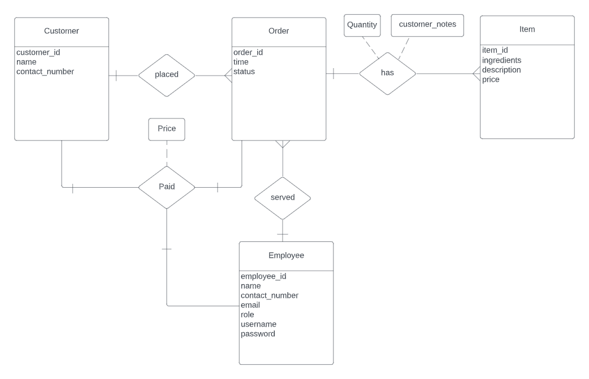
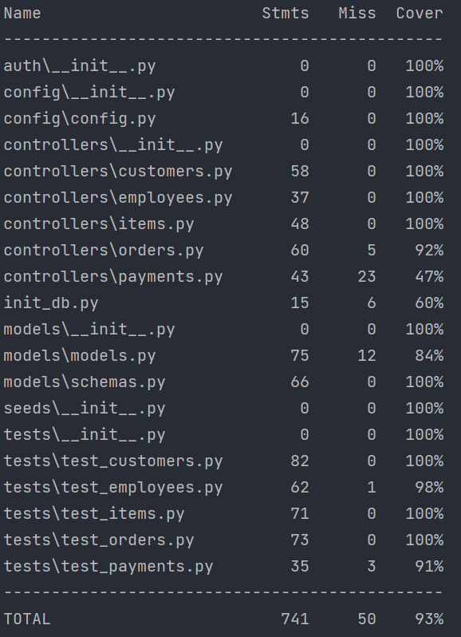

# Cafe REST API

Backend code for a coffee shop that allows employees to take customer orders


## Features

- Authentication and Authorization via a role-based control design pattern
- Ability to perform CRUD operations on orders, employees, customers, items, and payments


## ER Diagram



## API Reference

### Register a new employee

```http
  POST /auth/register
```

`Request Body`:
```yaml
{
  "contact_number": 555,
  "email": "five@gmail.com",
  "name": "five"
  "role": "cashier",
  "username": "five123",
  "password": "123"
}
```

`Response`:
```yaml
{
  "contact_number": 555,
  "email": five@gmail.com,
  "id": 1,
  "name": "five"
}

```

### Login as an Employee

```http
  POST /auth/login
```

`Request Body`:
```yaml
{
  "username": "five123",
  "password": "123"
}
```

`Response`:
```yaml
{
  "access_token": "secret"
}
```

### Get all employees

```http
  GET /operations/employees
```

| Parameter | Type     | Description                                 |
|:----------| :------- |:--------------------------------------------|
| `Token`   | `Bearer Token` | **Required**. JWT of an authorized employee |

`Response`:
```yaml
[
  {
    "contact_number": 555,
    "email": "five@gmail.com",
    "id": 1,
    "role": "cashier"
    "name": "five"
  },
  {
    "contact_number": 444,
    "email": "four@gmail.com",
    "id": 2,
    "role": "manager"
    "name": "four"
  }
]
```

### Delete employee

```http
  DELETE /operations/employees/${employee_id}
```

| Parameter | Type     | Description                       |
| :-------- | :------- | :-------------------------------- |
| `employee_id`| `integer` | **Required**. Id of employee to delete |
| `Token`   | `Bearer Token` | **Required**. JWT of an authorized employee |


`Response`:

```yaml
{
    "contact_number": 555,
    "email": "five@gmail.com",
    "role": "cashier"
    "id": 1,
    "name": "five"
}
```

### Get employee

```http
  GET /operations/employees/${employee_id}
```

| Parameter | Type     | Description                       |
| :-------- | :------- | :-------------------------------- |
| `employee_id`| `integer` | **Required**. Id of employee to fetch |
| `Token`   | `Bearer Token` | **Required**. JWT of an authorized employee |


`Response`:
```yaml
{
  "contact_number": 555,
  "email": five@gmail.com,
  "id": 1,
  "role": "cashier"
  "name": "five"
}
```
### Update employee

```http
  PUT /operations/employees/${employee_id}
```

| Parameter | Type     | Description                       |
| :-------- | :------- | :-------------------------------- |
| `employee_id`| `integer` | **Required**. Id of employee to update |
| `Token`   | `Bearer Token` | **Required**. JWT of an authorized employee |


`Request Body`:
```yaml
{
  "contact_number": 555,
  "email": "five@gmail.com",
  "name": "five"
}
```

`Response`:
```yaml
{
  "contact_number": 555,
  "email": five@gmail.com,
  "id": 1,
  "name": "five"
}
```


### Get all items

```http
  GET /operations/items
```

| Parameter | Type     | Description                       |
| :-------- | :------- | :-------------------------------- |
| `Token`   | `Bearer Token` | **Required**. JWT of an authorized employee |


`Response`:
```yaml
[
  {
    "id": 1,
    "ingredients": "",
    "name": "Curry Chicken with Onion",
    "price": "$7.00"
  },
  {
    "id": 2,
    "ingredients": "",
    "name": "Chicken with Black Beans",
    "price": "$7.00"
  }
]
```

### Create item

```http
  POST /operations/items
```


| Parameter | Type     | Description                       |
| :-------- | :------- | :-------------------------------- |
| `Token`   | `Bearer Token` | **Required**. JWT of an authorized employee |


`Request Body`:
```yaml
{
  "ingredients": "chicken, onions, rice",
  "name": "Curry Chicken with Onion",
  "price": "$7.00"
}
```

`Response`:
```yaml
{
  "id": 1,
  "ingredients": "",
  "name": "Curry Chicken with Onion",
  "price": "$7.00"
}
```

### Delete item

```http
  DELETE /operations/items/${item_id}
```

| Parameter | Type     | Description                       |
| :-------- | :------- | :-------------------------------- |
| `item_id`| `integer` | **Required**. Id of item to delete |
| `Token`   | `Bearer Token` | **Required**. JWT of an authorized employee |


`Response`:
```yaml
{
  "id": 1,
  "ingredients": "",
  "name": "Curry Chicken with Onion",
  "price": "$7.00"
}
```
### Get item

```http
  GET /operations/items/${item_id}
```

| Parameter | Type     | Description                       |
| :-------- | :------- | :-------------------------------- |
| `item_id`| `integer` | **Required**. Id of item to fetch |
| `Token`   | `Bearer Token` | **Required**. JWT of an authorized employee |


`Response`:
```yaml
{
  "id": 1,
  "ingredients": "",
  "name": "Curry Chicken with Onion",
  "price": "$7.00"
}
```

### Update item

```http
  PUT /operations/employees/${item_id}
```

| Parameter | Type     | Description                       |
| :-------- | :------- | :-------------------------------- |
| `item_id`| `integer` | **Required**. Id of item to update |
| `Token`   | `Bearer Token` | **Required**. JWT of an authorized employee |


`Request Body`:
```yaml
{
  "ingredients": "chicken, onions, rice",
  "name": "Curry Chicken with Onion",
  "price": "$10.00"
}
```

`Response`:
```yaml
{
  "id": 1,
  "ingredients": "",
  "name": "Curry Chicken with Onion",
  "price": "$10.00"
}
```

### Get all customers

```http
  GET /shop/customers
```

| Parameter | Type     | Description                       |
| :-------- | :------- | :-------------------------------- |
| `Token`   | `Bearer Token` | **Required**. JWT of an authorized employee |

`Response`:
```yaml
[
  {
    "contact_number": 1,
    "id": 1,
    "name": "one"
  },
  {
    "contact_number": 2,
    "id": 2,
    "name": "two"
  }
]
```

### Create customer

```http
  POST /shop/customers
```

| Parameter | Type     | Description                       |
| :-------- | :------- | :-------------------------------- |
| `Token`   | `Bearer Token` | **Required**. JWT of an authorized employee |

`Request Body`:
```yaml
{
  "contact_number": 3,
  "name": "three"
}
```


`Response`:
```yaml
{
  "id": 3,
  "contact_number": 3,
  "name": "three"
}
```

### Delete customer

```http
  DELETE /shop/customers/${customer_id}
```

| Parameter | Type     | Description                       |
| :-------- | :------- | :-------------------------------- |
| `customer_id`| `integer` | **Required**. Id of customer to delete |
| `Token`   | `Bearer Token` | **Required**. JWT of an authorized employee |


`Response`:
```yaml
{
  "id": 3,
  "contact_number": 3,
  "name": "three"
}
```
### Get customer

```http
  GET /shop/customers/${employee_id}
```

| Parameter | Type     | Description                       |
| :-------- | :------- | :-------------------------------- |
| `customer_id`| `integer` | **Required**. Id of customer to fetch |
| `Token`   | `Bearer Token` | **Required**. JWT of an authorized employee |


`Response`:
```yaml
{
  "id": 3,
  "contact_number": 3,
  "name": "three"
}
```

### Update customer

```http
  PUT /shop/customers/${customer_id}
```

| Parameter | Type     | Description                       |
| :-------- | :------- | :-------------------------------- |
| `customer_id`| `integer` | **Required**. Id of customer to update |
| `Token`   | `Bearer Token` | **Required**. JWT of an authorized employee |


`Request Body`:
```yaml
{
  "contact_number": 4,
  "name": "four"
}
```

`Response`:
```yaml
{
  "id": 4,
  "contact_number": 4,
  "name": "four"
}
```

### Get all orders

```http
  GET /shop/orders
```

| Parameter | Type     | Description                       |
| :-------- | :------- | :-------------------------------- |
| `Token`   | `Bearer Token` | **Required**. JWT of an authorized employee |

`Response`:
```yaml
[
 {
  "customer_id": 2,
  "employee_id": 5,
  "id": 7,
  "items_ordered": [
    {
      "customer_notes": "no salt",
      "item_id": 1,
      "quantity": 1
    }
  ],
  "order_time": "2022-07-25T07:20:08.023003",
  "status": "preparing"
},
{
  "customer_id": 1,
  "employee_id": 2,
  "id": 12,
  "items_ordered": [
    {
      "customer_notes": "A LOT OF SALT",
      "item_id": 5,
      "quantity": 2
    },
    {
      "customer_notes": "NO SUGAR",
      "item_id": 4,
      "quantity": 2
    }
  ],
  "order_time": "2022-07-25T07:20:08.023003",
  "status": "preparing"
]
```

### Create order

```http
  POST /shop/orders
```


| Parameter | Type     | Description                       |
| :-------- | :------- | :-------------------------------- |
| `Token`   | `Bearer Token` | **Required**. JWT of an authorized employee |

`Request Body`:
```yaml
{
  "customer_id": 2,
  "employee_id": 3,
  "items_ordered": [
    {
      "customer_notes": "extra salt",
      "item_id": 3,
      "quantity": 2
    }
  ],
  "status": "preparing"
}
```


`Response`:
```yaml
{
  "customer_id": 2,
  "employee_id": 1,
  "id": 19,
  "items_ordered": [
    {
      "customer_notes": "extra salt",
      "item_id": 3,
      "quantity": 2
    }
  ],
  "order_time": "2022-07-25T10:12:40.397597",
  "status": "preparing"
}
```

### Delete order

```http
  DELETE /shop/orders/${order_id}
```

| Parameter | Type     | Description                       |
| :-------- | :------- | :-------------------------------- |
| `order_id`| `integer` | **Required**. Id of order to delete |
| `Token`   | `Bearer Token` | **Required**. JWT of an authorized employee |


`Response`:

```yaml
{
  "customer_id": 2,
  "employee_id": 1,
  "id": 19,
  "items_ordered": [
    {
      "customer_notes": "extra salt",
      "item_id": 3,
      "quantity": 2
    }
  ],
  "order_time": "2022-07-25T10:12:40.397597",
  "status": "preparing"
}
```
### Get order

```http
  GET /shop/orders/${order_id}
```

| Parameter | Type     | Description                       |
| :-------- | :------- | :-------------------------------- |
| `order_id`| `integer` | **Required**. Id of order to fetch |
| `Token`   | `Bearer Token` | **Required**. JWT of an authorized employee |


`Response`:
```yaml
{
  "customer_id": 1,
  "employee_id": 2,
  "id": 12,
  "items_ordered": [
    {
      "customer_notes": "A LOT OF SALT",
      "item_id": 5,
      "quantity": 2
    },
    {
      "customer_notes": "NO SUGAR",
      "item_id": 4,
      "quantity": 2
    }
  ],
  "order_time": "2022-07-25T07:44:11.668169",
  "status": "preparing"
}
```
### Update order

```http
  PUT /shop/orders/${order_id}
```

| Parameter | Type     | Description                       |
| :-------- | :------- | :-------------------------------- |
| `order_id`| `integer` | **Required**. Id of order to update |
| `Token`   | `Bearer Token` | **Required**. JWT of an authorized employee |


`Request Body`:
```yaml
{
  "customer_id": 1,
  "employee_id": 2,
  "items_ordered": [
    {
      "customer_notes": "chicken tika masala",
      "item_id": 1,
      "quantity": 2
    }
  ],
  "status": "preparing"
}
```


`Response`:
```yaml
{
  "customer_id": 1,
  "employee_id": 2,
  "id": 12,
  "items_ordered": [
    {
      "customer_notes": "chicken tika masala",
      "item_id": 1,
      "quantity": 2
    }
  ],
  "order_time": "2022-07-25T07:44:11.668169",
  "status": "preparing"
}
```

### Read all receipts

```http
  GET /operation/payments
```

| Parameter | Type     | Description                       |
| :-------- | :------- | :-------------------------------- |
| `Token`   | `Bearer Token` | **Required**. JWT of an authorized employee |


`Response`:
```yaml
[
    {
        "customer_id": 1,
        "employee_id": 1,
        "order_id": 1,
        "price": "12"
    },
    {
        "customer_id": 1,
        "employee_id": 2,
        "order_id": 2,
        "price": "13"
    },
]
```

### Get receipt

```http
  GET /operation/payments/${order_id}
```

| Parameter | Type     | Description                       |
| :-------- | :------- | :-------------------------------- |
| `Token`   | `Bearer Token` | **Required**. JWT of an authorized employee |

`Response`:
```yaml
{
    "customer_id": 1,
    "employee_id": 1,
    "order_id": 1,
    "price": "12"
}
```

### Create receipt

```http
  POST /operation/payments/${order_id}
```

| Parameter | Type     | Description                                      |
| :-------- | :------- |:-------------------------------------------------|
| `order_id`| `integer` | **Required**. Id of order to find the receipt of |
| `Token`   | `Bearer Token` | **Required**. JWT of an authorized employee      |


```yaml
{
    "customer_id": 1,
    "employee_id": 1,
    "order_id": 1,
    "price": "$67.50"
}
```

## Running Tests

To run tests, navigate to `.\services\backend\project` directory

```bash
  cd .\services\backend\project\
```


run the following command


```bash
  coverage run -m unittest discover
```

Use coverage report to report on the results

```bash
  coverage report
```

The current coverage management is as follows



## Authors

- [@Mahmoud Salah](https://www.github.com/MahmoudSalah02)